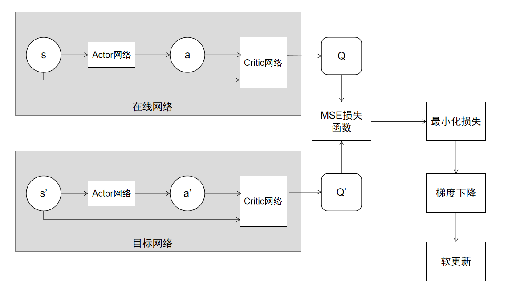
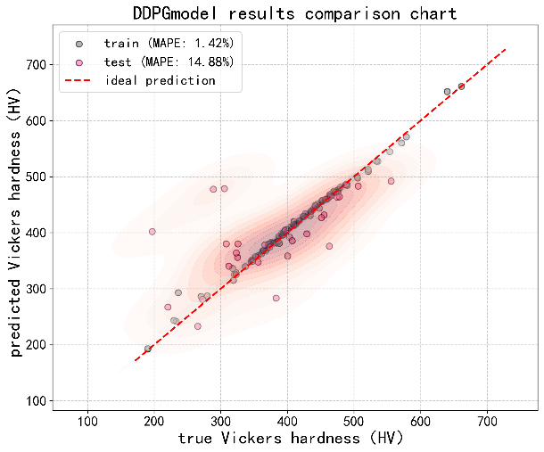
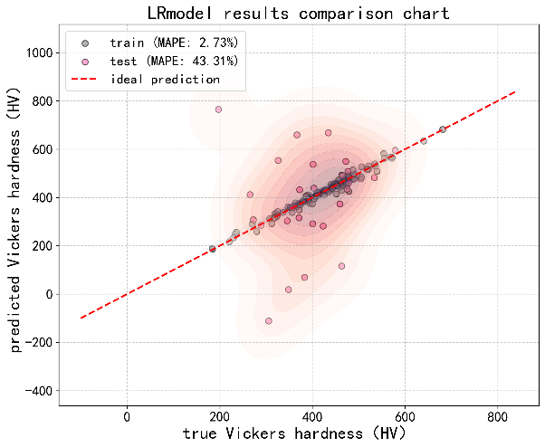
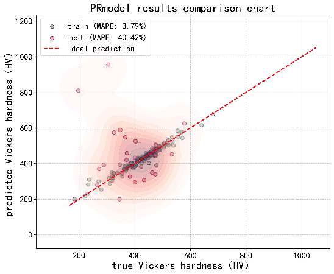
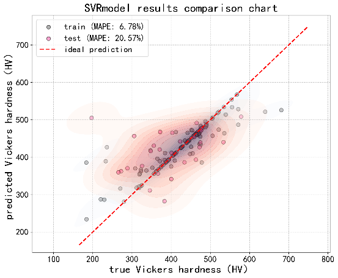

# 基于深度确定性策略梯度的合金材料维氏硬度预测算法

> 本文件由 Word 文档自动转换得到，文字内容与原论文一致；
> 图片已提取到 `images/` 目录，在文中以 `` 形式引用。

---

# 基于深度确定性策略梯度的合金维氏硬度预测算法

摘要：本文提出了一种基于深度确定性策略梯度（DDPG）的回归预测模型，用于精准预测合金材料的维氏硬度。该研究将硬度预测问题建模为强化学习中的连续动作空间优化任务，构建了一个融合深度神经网络与经验回放机制的端到端回归框架。模型采用经预训练模型提取与PCA降维的高维微观结构特征与成分特征作为输入，通过Actor-Critic网络结构进行硬度值回归，并结合优先经验回放（PER）、高斯噪声探索策略以及分段奖励函数设计，提升训练的稳定性与效率。为进一步增强模型泛化能力，研究引入了GAN生成的数据增强机制。实验结果表明，在原始数据上，DDPG模型优于传统回归方法；在GAN增强数据集上，模型性能显著提升，训练集与测试集的R²均超过0.96，平均绝对百分比误差（MAPE）稳定在1.4%左右，展现出优异的预测精度与泛化稳定性。本研究为材料性能预测提供了一种基于强化学习的新范式，兼具理论创新与工程应用价值。

关键词：合金维氏硬度；强化学习；深度确定性策略梯度；GAN数据增强；微观结构特征；成分特征

Alloy Vickers Hardness Prediction Algorithm based on Deep Deterministic Policy Gradient

Abstract: This paper proposes a regression prediction model based on Deep Deterministic Policy Gradient (DDPG) for accurately predicting the Vickers hardness of alloy materials. The study models the hardness prediction problem as a continuous action space optimization task in reinforcement learning, and constructs an end-to-end regression framework that integrates deep neural networks with an experience replay mechanism. The model takes high-dimensional microstructural and compositional features extracted from pre-trained models and reduced by Principal Component Analysis (PCA) as inputs, and performs hardness value regression through an Actor-Critic network structure. It combines Prioritized Experience Replay (PER), Gaussian noise exploration strategy, and piecewise reward function design to enhance training stability and efficiency. To further enhance the model's generalization ability, the study introduces a data augmentation mechanism generated by Generative Adversarial Networks (GANs). Experimental results show that on the original dataset, the DDPG model outperforms traditional regression methods; on the GAN-enhanced dataset, the model performance is significantly improved, with R² values exceeding 0.96 for both the training and test sets, and the Mean Absolute Percentage Error (MAPE) stabilizing at around 1.4%, demonstrating excellent prediction accuracy and generalization stability. This study provides a new paradigm for material property prediction based on reinforcement learning, combining theoretical innovation with engineering application value.

Keywords: alloy Vickers hardness; reinforcement learning; deep deterministic policy gradient; GAN data augmentation; microstructural features; compositional features;

# 1 引言

传统合金设计依赖“试错法”，耗时长、成本高。机器学习能够从已有数据中挖掘成分、工艺参数与性能之间的复杂非线性关系，实现高性能合金的快速预测与逆向设计，显著加速材料研发进程[1]。多数研究聚焦于高熵合金的硬度预测，采用多种机器学习模型，并普遍引入可解释性方法（如SHAP）分析特征影响。Ren et al.提出结合固溶强化理论与可解释机器学习的方法 [2]。Zhang et al.采用集成学习在Al-Co-Cr-Cu-Fe-Ni体系上实现R²=0.93[3]。Chen et al. 使用贝叶斯优化神经网络，R²达0.973，并揭示价电子浓度与铝含量对硬度的关键影响[4]。研究不仅限于高熵合金，还拓展至轻质合金、涂层材料、钨合金等。Jain et al. 在Al-Mg系轻质合金中采用CatBoost模型，实现高效硬度预测[5]。Zhai et al. 针对电沉积Ni-W涂层，使用KNN模型预测硬度[6]。Dai et al. 研究弥散强化钨合金，发现增强晶粒尺寸和相对密度对硬度影响最显著[7]。研究中常见的机器学习算法分为下面三种类型。集成学习模型，如Random Forest、XGBoost、LightGBM、CatBoost，在多篇研究中表现优异[8]。神经网络包括ANN、BPNN等，在部分研究中取得最高预测精度[9]。支持向量机（SVM）在激光熔覆涂层硬度预测中表现较好[10]。特征选择与可解释分析是提升模型可信度的关键。常用特征包括价电子浓度（VEC）、混合熵、原子尺寸差、相等[11]。SHAP分析广泛用于揭示各元素或工艺参数对硬度的贡献方向与程度[12]。多数研究通过实验验证模型预测结果，部分研究进一步结合优化算法（如NSGA-II、PSO、GA）进行成分逆向设计。Dey et al. 结合NSGA-II优化，使高熵合金的硬度提升超过24%[13]。Han et al. 提出深度学习框架，结合遗传算法与粒子群优化，设计出多种高硬度高熵合金成分[14]。

尽管机器学习在合金设计中成效显著，仍面临以下挑战。传统预测方法主要依赖于基于物理的经验公式或经典机器学习模型（如线性回归、支持向量机等然而，这些方法在面对由多元复杂成分与微观结构共同决定的高维、非线性、强耦合的材料性能空间时，往往显得力不从心[15-16]。尤其当实验数据稀缺、样本量有限（小样本问题）时，传统模型极易出现过拟合或泛化能力急剧下降的困境，其预测精度和可靠性面临严峻挑战[17]。因此，发展一种能够有效挖掘高维特征间复杂非线性关系、且在小样本条件下仍具优异泛化能力的新型预测范式，成为当前材料信息学领域急需解决的关键问题。

鉴于此，本研究首次提出并构建了一种基于深度确定性策略梯度（Deep Deterministic Policy Gradient, DDPG）的强化学习回归框架，用于合金维氏硬度的精准预测。本研究将硬度预测问题重新定义为：一个智能体在面对给定合金成分与微观结构特征时，如何选择一个最优的硬度预测值，以最大化由预测准确性所构成的累积奖励。为克服小样本数据下的训练不稳定与泛化难题，本研究进行了一系列关键性设计。首先，采用优先经验回放机制高效利用有限数据，加速关键经验的学习；其次，设计了结合绝对误差与相对误差的分段奖励函数，并引入探索噪声衰减策略，以平衡训练过程中的探索与利用；最后，创新性地集成生成对抗网络（GAN）进行数据增强，从根本上扩充和丰富了训练样本的分布。通过上述方法，本研究旨在实现一个端到端、高精度、强泛化的硬度智能预测模型，为材料性能预测开辟一条强化学习驱动的新途径，并为解决材料科学中的其他小样本回归问题提供有益的参考。

# 2 数据准备与预处理方法

数据准备阶段采用系统化的预处理流程确保数据质量。原始数据是149个合金的相关数据，每个合金的数据包括一张微结构图、22个成分特征、一个维氏硬度值。为了充分利用微结构进行合金预测，使用基于Vision Transformer架构的自监督视觉模型提取每个微结构图片的768维特征，并使用主成分分析技术(principal components analysis,PCA)抽取了70维作为微结构关键特征。通过对常见的模型clip_b16、clip_b32、clip_l14、dino_b、dino_g、dino_l、dino_s、Nasa进行性能分析，本文选用DINOv2-Base 模型，因为该模型在性能、速度和通用性之间取得极佳平衡[18]。基于此，本文构建了149条合金数据，包含70个微观结构特征、22个成分特征及目标变量维氏硬度的完整数据集。

针对可能存在的异常值问题，采用分位数截断策略保留百分之一至百分之九十九分位数范围内的有效数据，消除极端异常值对模型训练的干扰。异常值处理如公式1所示。

(1)

在公式1中，是处理后的数据点，是经过分位数截断处理后的新数值。这个值保证在区间内。是原始数据点，是需要被检查和处理的数据集中的原始数值；是上限边界值，是通过上限分位数计算得出的截断边界，其计算如公式2所示。

(2)

在公式2中，是上限分位数。其作用是将所有大于此值的数字都会被拉回到这个边界。是下限边界值，是通过下限分位数计算得出的截断边界，其计算如公式3所示。

(3)

在公式3中，是下限分位数。其作用是将所有小于此值的数字都会被提升到这个边界。

为保障模型评估的可靠性，数据集被划分为训练集、验证集和测试集，其中验证集用于超参数调优和训练过程监控。我们对输入特征和目标变量分别进行了标准化处理，将其转换为均值为零、标准差为一的标准正态分布。标准化的计算如公式4所示。

(4)

在公式4中，是标准化后的值，是原始值，是样本均值，是标准差，样本均值的计算如公式5所示。

(5)

其中是样本数量，是第个样本值，标准差计算如公式6所示。

(6)

该处理旨在消除不同特征之间量级与量纲的差异，从而有效解决由此引发的模型训练困难，提升训练的稳定性与收敛效率。

# 3 网络模型设计

## 3.1 模型架构设计

DDPG是一种基于ActorCritic架构的深度强化学习算法，专门适用于连续动作空间的回归任务。我们将材料科学中的硬度预测问题建模为一个强化学习环境：以材料的70维微观结构特征和成分特征作为状态（State），以预测的硬度值作为连续动作（Action），并根据预测误差设计奖励函数（Reward）来指导模型优化。该模型包含两个核心神经网络。Actor策略网络负责根据输入状态生成硬度预测动作，Critic价值网络则评估该动作在当前状态下的质量。为了确保训练稳定性，每个主网络都配备了相应的目标网络，通过软更新机制缓慢同步参数，共同构建了一个端到端的强化学习回归框架。

为了确保DDPG模型在训练过程中的稳定性，该架构为每个主网络都设置了结构完全相同的目标网络，包括与Actor主网络一致的Actor目标网络，与Critic主网络一致的Critic目标网络。这些目标网络通过一种称为软更新的机制与主网络保持参数同步，其核心更新方法如公式7所示。

（7）

在公式7中，表示网络参数，表示目标网络的参数，是一个极小的更新系数，表示参数更新操作。这种设计通过加权平均的方式，使目标网络的参数更新呈现出缓慢平滑的变化特性，有效避免了因目标值剧烈波动而导致的训练不稳定性，为Critic网络提供了相对稳定的学习目标，从而显著提升了整个模型的收敛性能和训练可靠性。模型架构图如图1所示。

图 1 模型架构

MSE损失函数是量化模型预测的准确程度。它通过计算预测值与真实值之间差异的平方平均值，为模型性能提供一个具体的数值评价。这个数值越小，说明模型的预测越接近真实情况，预测精度越高。其计算如公式8所示。

(8)

在公式8中，表示样本数量，表示第i个样本的真实值，表示第i个样本的预测值，对误差进行平方，其目的是消除正负误差相互抵消的问题；放大较大误差的惩罚。

## 3.2 DDPG的网络模型设计

Actor网络作为DDPG模型中的策略网络，承担着根据输入状态生成预测动作的核心功能。网络采用深度全连接架构，输入层接收材料特征构成的状态向量，随后经过四个隐藏层进行特征变换。前两个隐藏层均包含1024个神经元，配备批归一化层稳定训练过程，使用LeakyReLU激活函数引入非线性表达能力，并采用Dropout技术防止过拟合；后续两层分别包含512和256个神经元，在保持批归一化和LeakyReLU激活的基础上逐步压缩特征维度。最终输出层通过Tanh激活函数将预测值约束在[1,1]范围内，再通过线性缩放变换映射到实际硬度值的合理区间，从而完成从材料特征到硬度预测的端到端映射。

Critic网络作为DDPG模型中的价值评估网络，采用独特的双流处理架构，来精确评估在特定状态下执行某个动作的预期收益。通过两个独立的特征提取通路分别处理状态和动作信息：状态处理通路将材料特征输入转换为512维的特征向量，经过批归一化、ReLU激活和随机失活处理；动作处理通路则将预测的硬度值映射为256维的特征表示，同样经过批归一化和ReLU激活。随后，两个通路的输出特征在拼接层汇合形成768维的联合特征表示，通过三个全连接层逐步压缩维度，最终输出单一的Q值评分。这种双流设计使得网络能够充分捕捉状态与动作之间的复杂交互关系，为Actor网络的策略优化提供准确的价值指引。

## 3.3 动作空间（Action Space）

模型通过动作缩放机制将网络输出的规范动作映射到实际目标变量范围。在训练初期采用主动探索策略，在动作输出中添加符合高斯分布的随机噪声，促进模型探索不同的预测可能性。随着训练进程推进，噪声强度按照指数衰减规律逐渐降低，但保留最小噪声水平维持一定的探索能力。这种动态平衡机制使模型在训练初期充分探索动作空间，在训练后期逐渐专注于利用学到的知识。

动作的本质是模型对目标变量（维氏硬度，HV）的预测值。算法的动作空间维度为1，这是一个一维的连续动作空间，其目标是预测一个表示硬度的连续标量值。为了约束输出范围，在Actor网络的输出层使用了Tanh作为激活函数，从而将网络输出的原始动作值限制在[1,1]的区间内。为了将Actor网络输出的理论范围[-1,1]映射到真实硬度值的实际分布区间，从而计算出有意义的奖励，通过动作缩放机制实现从归一化动作到实际硬度值的精确转换。该机制主要通过记录目标变量标准化后的最小值与最大值，其计算如公式9所示。

(9)

在公式9中，是原始的在[-1,1]范围内的动作；是缩放后在范围内的动作；是目标范围的最大值；是目标范围的最小值。将动作从[1,1]线性映射到的真实范围。其逆操作使用公式10。

(10)

其中，是缩放后在范围内的动作；是归一化后在[-1,1]范围内的动作；是目标范围的最大值；是目标范围的最小值。将真实范围的动作映射为[1,1]的理论范围，以便正确地存入经验回放缓冲区。

## 3.4 奖励函数

奖励函数的设计基于误差驱动反馈和渐进式奖励结构的核心思想。误差越小对应的奖励值越高，形成正向激励循环。奖励函数采用分段设计策略，对不同误差范围给予差异化的奖励权重，重点关注中等误差区域的优化改进。同时设置奖励上下限防止奖励信号幅度过大影响训练稳定性，确保模型能够获得有意义的梯度更新方向。目标是鼓励高精度预测的同时，避免对微小误差的过度惩罚，从而保证训练的稳定性和收敛性。

首先计算绝对误差，计算如公式所示

（11）

这一基础指标直接反映了预测的准确程度，是后续奖励计算的基础。进行分段奖励，采用五段式奖励结构，根据不同误差范围给予差异化的奖励。计算如公式所示。

（12）

在公式中，j是判断的值，B是基础奖励值，当error<0.05时，B为5；当0.05<error<0.1时，B为3；当0.1<error<0.2时，B为2；当0.2<error<0.5时，B为1；当误差大于0.5时，其计算如公式所示。

（13）

然后进行相对误差奖励。相对误差的计算如公式所示。

（14）

这一机制考虑了目标值的尺度效应，使奖励函数对不同量级的预测目标具有更好的适应性。当相对误差小于0.1时，提供额外奖励，计算如公式所示。

（15）

最后采用硬截断方式将最终奖励限制在合理范围内，其计算如公式所示。

（16）

公式将最终奖励值限制在区间内，防止奖励过大或过小。该奖励函数的核心目标是引导DDPG的Actor网络输出一个尽可能接近真实目标值的预测值。它通过计算预测值与真实值之间的误差，并根据误差的大小和性质给予模型相应的奖励或惩罚。

# 4 网络模型训练策略

## 4.1探索策略（Exploration Strategy）

在强化学习中，探索的目的是尝试新的行为以发现可能带来更高回报的策略。探索表现为对预测值（动作）添加噪声。

设定了四个关键的超参数来系统性地控制DDPG算法的探索过程。初始噪声标准差0.2决定了探索的起始幅度，其值越大，早期阶段的随机探索性就越强。噪声衰减率0.995则负责在每个训练周期后对噪声标准差进行衰减，这个接近于1的值意味着衰减过程非常缓慢，旨在确保模型在训练中期仍能进行充分的探索。为了维持一个最基本的随机性，设定了最小噪声标准差0.05作为探索强度的下限，防止策略完全收敛后探索停滞。此外，还定义了最大探索步数5000，尽管并未直接用它来完全关闭噪声，但它可以作为训练阶段的一个参考指标，实际的探索管理主要通过上述的衰减机制和最小值约束来实现。

在DDPG算法的执行过程中，探索行为分为训练与评估两种模式。在模型训练时，会启动探索机制，为Actor网络输出的动作添加噪声，从而鼓励智能体探索未知的状态动作空间。相反，在评估模型性能时， Actor网络将直接输出其确定的预测值而不引入任何随机扰动，此举旨在关闭探索、完全利用已学到的策略，从而获得稳定且可重复的预测结果，以便对模型的真实性能进行可靠评估。

除了常规的动作噪声探索机制，还采用了一种名为“目标策略平滑”的技巧来进一步提升训练的稳定性。在通过目标Actor网络计算出下一个动作后，会为其添加一个微小的、经过裁剪的高斯噪声（噪声标准差为0.01，并被限制在[0.02,0.02]的范围内这一操作可以视为对目标Q值的一种正则化处理，其核心作用在于防止Critic网络过拟合到目标Actor网络可能产生的某些不稳定的、尖锐的动作峰值上，从而使得Critic对动作价值的评估更加平滑和鲁棒，最终有效促进整个DDPG训练过程的稳定。

## 4.2 经验回放策略

DDPG算法采用了优先经验回放（Prioritized Experience Replay,PER）作为其核心组件之一。经验回放是强化学习稳定训练的关键。经验回放机制是模型训练的关键创新点，采用优先级经验回放缓冲区存储训练过程中的状态转移经验。每个经验元组包含当前状态、执行动作、获得奖励、下一状态和终止标志五个要素。缓冲区根据样本的时间差分误差计算优先级，误差越大的样本被抽中的概率越高，这种优先级采样策略显著提高了数据利用效率。缓冲区设置固定容量，当经验数量超过容量时自动覆盖最早的经验记录，确保训练数据的时效性。

智能体与环境交互产生的数据（状态、动作、奖励）是高度相关的。直接用这些连续的数据训练神经网络会导致训练不稳定、难以收敛。经验回放通过存储数据并随机采样来打破这种相关性，使训练数据更接近独立同分布。每一次与环境交互获得的经验都可以被多次用于训练，大大提高了数据的利用效率。对过去的经验进行回放，可以避免模型遗忘之前的经历，有助于学习到更鲁棒的策略。

经验存储是强化学习中的关键机制，用于积累和复用智能体的交互数据。经验池通过列表buffer实现，并以环形缓冲区的形式管理。每个存储单元不是一个孤立的值，而是以五元组的形式存储，如公式17所示。

（17）

其中包含单次交互的状态、动作、即时奖励、后续状态及终止标志。这种结构化存储确保了评估状态动作对价值所需的完整性，为后续训练提供了充分的环境上下文。

优先经验回放是对传统均匀采样的改进，核心在于根据经验的学习价值差异化采样频率。每个经验样本都有一个关联的优先级。新经验的优先级被初始化为当前缓冲区的最大优先级，以确保能被快速采样。采样概率基于优先级计算(如公式18所示)。

(18)

在公式中，是第个样本的优先级，代表优先程度超参数。它控制了优先采样的程度，当时退化为均匀采样；时完全按优先级采样。是一个求和索引变量，表示遍历经验回放缓冲区中的每一个样本。

由于优先采样改变了数据的分布，会引入偏差，因此需要使用重要性采样权重来进行修正重要性采样权重(如公式19所示)。

(19)

在公式19中，是当前经验回放缓冲区中的经验总数。是偏差修正超参数。并通过归一化稳定训练，在训练初期，对偏差的修正较弱(较小)；随着训练进行，逐步增强修正(线性增加到1.0)。采样后，系统利用时序差分误差绝对值更新对应经验的优先级，误差越大则优先级越高，从而引导模型聚焦于当前预测不准的样本。

# 5 评估指标及结果分析

## 5.1 对比算法

为评估深度确定性策略梯度（DDPG）强化学习模型在材料硬度预测任务中的性能，将其与传统机器学习回归模型进行对比。本研究选取线性回归（Linear Regression,LR）、多项式回归（Polynomial Regression,PR）、支持向量回归（Support Vector Regression,SVR）作为对比基准，通过多种可视化方法综合分析各模型的预测误差分布特性。

## 5.2 评估指标

本模型采用四维评估指标体系，从不同角度全面评估回归模型的预测性能。评估覆盖训练集、验证集、测试集三个关键数据集，确保对模型拟合能力和泛化性能的完整评估。

均方根误差可以用来衡量预测值与真实值的平均偏差程度；对异常值敏感，能够放大较大误差的影响；保持与目标变量相同的量纲，便于直观理解；值越小表示模型预测精度越高。其计算如公式20。

（20）

平均绝对误差可以用来反映预测误差的绝对平均水平；对异常值的敏感度低于RMSE，更具鲁棒性；同样保持原始量纲，解释性直观；提供误差分布的稳健估计。其计算如公式21。

（21）

决定系数可以用来衡量模型解释目标变量方差的比例；取值范围为[∞,1]，越接近1表示拟合效果越好；无量纲指标，便于不同模型间的比较；反映模型对数据模式的捕捉能力。其计算如公式22。

（22）

平均绝对百分比误差以百分比形式表示相对误差大小；可以用来排除零值干扰，确保计算稳定性；提供误差的相对尺度，便于业务理解；值越小表示预测的相对准确性越高。其计算如公式23。

（23）

通过综合分析四个指标，能够判断模型是否过拟合或欠拟合；识别模型在不同数据区间的表现差异；建立模型性能的量化基准。这套评估体系确保了模型性能评估的全面性和实用性，为DDPG回归模型在维氏硬度硬度预测领域的可靠应用提供了坚实保障。

## 5.3 材料维氏硬度预测比较

结果如表 1-2 所示。从表中可知，在材料维氏硬度预测这一复杂非线性回归任务中，DDPG模型展现出卓越的性能表现，在训练集上MAPE仅1.42%、R²高达0.9904，RMSE和MAE分别控制在8.05HV和5.2HV的极低水平，体现了强大的数据拟合能力；在测试集上MAPE为14.88%，显著优于其他传统模型，且R²达到0.3304，虽不理想但在对比模型中最为优秀，同时验证集MAPE9.28%表明模型具备一定的泛化能力。

表1训练集的结果对比

| 模型 | 数据集类型 | RMSE(HV) | MAE(HV) | R² | MAPE(%) |
| --- | --- | --- | --- | --- | --- |
| DDPG | 训练集 | 8.05 | 5.2 | 0.9904 | 1.42 |
| LR | 训练集 | 14.67 | 11.18 | 0.9733 | 2.73 |
| PR | 训练集 | 20.2 | 14.61 | 0.9494 | 3.79 |
| SVR | 训练集 | 44.97 | 22.5 | 0.7493 | 6.78 |

表 2 测试集的结果对比

| 模型 | 数据集类型 | RMSE(HV) | MAE(HV) | R² | MAPE(%) |
| --- | --- | --- | --- | --- | --- |
| DDPG | 测试集 | 70.67 | 45.69 | 0.3304 | 14.88 |
| LR | 测试集 | 203.63 | 142.39 | -4.6463 | 43.31 |
| PR | 测试集 | 201.46 | 125.38 | -4.5262 | 40.42 |
| SVR | 测试集 | 88.22 | 65.16 | -0.0597 | 20.57 |

DDPG 的结果图，如图 6 所示。传统模型的结果图，如图 7，8，9 所示。从对比图可直观看出，DDPG的预测数据点紧密分布在理想预测线附近，而传统模型数据点分散且极端值区域预测偏差明显，DDPG拟合线的斜率更接近1、截距更接近0，这些特征共同证明了深度强化学习架构能够有效捕捉材料硬度的复杂非线性关系，展现了方法在回归预测的优势。

图 2 DDPG结果图

图 3 LR结果图

图 4 PR结果图

图 5 SVR结果图

## 5.4 数据扩充对算法性能影响分析

在初始实验阶段，由于原始数据量严重不足，各机器学习模型普遍出现了明显的过拟合现象。为解决这一根本性问题，我们引入生成对抗网络（GAN）技术来扩充训练数据集。通过GAN生成符合原始数据分布的合成样本，我们期望能够为各模型提供更充分的学习素材，更好地捕捉数据的本质规律而非表面噪声，从而显著提升所有模型在测试集上的泛化性能，减少过拟合现象的发生。

结果如表 3-4 所示，

表 3 （训练集）使用GAN数据的结果及对比

| 模型 | 数据集类型 | RMSE(HV) | MAE(HV) | R² | MAPE(%) |
| --- | --- | --- | --- | --- | --- |
| DDPG | 训练集 | 15.45 | 6.09 | 0.9641 | 1.47 |
| LR | 训练集 | 15.45 | 10.33 | 0.9526 | 2.56 |
| PR | 训练集 | 1.23 | 0.83 | 0.9997 | 0.2 |
| SVR | 训练集 | 16.93 | 9.51 | 0.9431 | 2.35 |

表 4 （测试集）使用GAN数据的结果及对比

| 模型 | 数据集类型 | RMSE(HV) | MAE(HV) | R² | MAPE(%) |
| --- | --- | --- | --- | --- | --- |
| DDPG | 测试集 | 14.95 | 5.84 | 0.9665 | 1.41 |
| LR | 测试集 | 17.73 | 10.71 | 0.9386 | 2.61 |
| PR | 测试集 | 1498.13 | 191.37 | -437.1577 | 46.88 |
| SVR | 测试集 | 19.33 | 9.95 | 0.927 | 2.42 |

从表中可知，DDPG模型展现出最为均衡和优秀的性能，其在训练集、验证集和测试集上的关键指标高度一致：MAPE稳定在1.47%、1.48%和1.41%，R²均保持在0.96以上的高水平。这种跨数据集的稳定表现证明DDPG成功学习了数据的内在规律，而非简单地记忆训练样本，体现了深度强化学习在复杂非线性关系建模中的独特优势。

相比之下，多项式回归(PR)模型出现了严重的过拟合现象。尽管在训练集上取得了近乎完美的表现（MAPE0.2%，R²0.9997），但在测试集上性能急剧恶化，MAPE飙升至46.88%，R²更是跌至-437.16的异常值。这种巨大落差表明PR模型过度适应了训练数据的噪声特性，未能获得真正的泛化能力。

线性回归(LR)和支持向量回归(SVR)表现出中等程度的泛化能力下降。LR模型从训练集到测试集的MAPE从2.56%上升至2.61%，SVR从2.35%上升至2.42%，虽然下降幅度相对温和，但仍反映出在未见数据上预测精度的轻微损失。

综合来看，DDPG模型在本任务中展现出了最佳的泛化性能和稳定性，其强化学习框架能够有效平衡模型复杂度和泛化能力，避免了传统机器学习方法容易出现的过拟合或欠拟合问题，为硬度预测提供了一种更为可靠的建模方案。

# 结束语

本研究成功构建了一种基于深度确定性策略梯度（DDPG）的合金维氏硬度预测模型，将材料性能预测问题转化为连续动作空间的强化学习任务，实现了端到端的回归预测。通过结合高维特征提取、优先经验回放、分段奖励机制以及多项训练优化策略，模型在复杂特征空间中表现出良好的拟合能力。实验表明，尽管在原始数据集上存在一定过拟合，但通过GAN数据增强，模型在保持高精度的同时显著提升了泛化性能，测试集R²超过0.96，MAPE降至1.4%左右，验证了该方法在材料硬度预测中的有效性与鲁棒性。

本工作的主要贡献在于：第一，提出了基于DDPG的回归预测框架，拓展了强化学习在材料性能建模中的应用边界；第二，设计了适用于硬度预测的分段奖励函数与探索策略，提升了训练稳定性；第三，通过GAN增强数据显著改善了模型在小样本场景下的泛化能力。然而，研究仍存在一定局限性，如模型对高质量数据增强的依赖性较强，且在多目标性能协同预测方面尚未拓展。

未来工作可围绕以下方向展开：引入多任务强化学习框架以同时预测多种力学性能；探索更具解释性的网络结构，增强模型在材料设计中的可解释性；将该方法推广至更广泛的材料体系与性能指标，进一步验证其普适性与工程适用性。

# 数据

数据：本文构建了149条合金数据，包含70个微观结构特征、22个成分特征及目标变量维氏硬度的完整数据集。

GAN数据：

# 参考文献

[1]Rahman A, Hossain M S, Siddique A B. machine learning approaches for diverse alloy systems[J]. Journal of Materials Science, 2025, 60(29): 12189-12221.

[2] Ren W, Zhang Y F, Wang W L, et al. Prediction and design of high hardness high entropy alloy through machine learning[J]. Materials & Design, 2023, 235: 112454.

[3]Zhang Y F, Ren W, Wang W L, et al. Interpretable hardness prediction of high-entropy alloys through ensemble learning[J]. Journal of Alloys and Compounds, 2023, 945: 169329.

[4]Chen K, Min B W. Predicting hardness in high entropy alloys with explainable machine learning[J]. Materials Today Communications, 2025, 45: 112388.

[5]Sandeep Jain, Reliance Jain, Sheetal Dewangan, Ayan Bhowmik, A Machine learning perspective on hardness prediction in multicomponent Al-Mg based lightweight alloys,2024

[6]Zhai S, Sugio K, Sasaki G, et al. Hardness prediction of electrodeposited Ni-W alloy coatings using machine learning[J]. Materials Today Communications, 2025, 44: 112018.

[7]Dai S, Chen C, Zhang C, et al. Machine Learning-Assisted Hardness Prediction of Dispersion-Strengthened Tungsten Alloy[J]. Metals, 2025, 15(3): 294.

[8]Gao Z, Zhao F, Gao S, et al. Machine learning prediction of hardness in solid solution high entropy alloys[J]. Materials Today Communications, 2023, 37: 107102.

[9]Paturi U M R, Ishtiaq M, Lakshmi Narayana P, et al. Evaluating Machine Learning Models for Predicting Hardness of AlCoCrCuFeNi High-Entropy Alloys[J]. Crystals, 2025, 15(5): 404.

[10]Shu L, Huang T, Qiu Y, et al. Machine learning assisted hardness prediction and experimental verification of laser cladding coatings[J]. Materials Today Communications, 2025, 46: 112551.

[11]Shen L, Chen L, Huang J, et al. Predicting phases and hardness of high entropy alloys based on machine learning[J]. Intermetallics, 2023, 162: 108030.

[12]Guo Q, Pan Y, Hou H, et al. Predicting the hardness of high-entropy alloys based on compositions[J]. International Journal of Refractory Metals and Hard Materials, 2023, 112: 106116.

[13]Dey D, Pal A, Biyani P, et al. Developing new high-entropy alloys with enhanced hardness using a hybrid machine learning approach: integrating interpretability and NSGA-II optimization[J]. Journal of Materials Science, 2025: 1-26.

[14]Han Y, Wang H, Xu P, et al. Deep Learning-Based Framework for Efficient Design of Multicomponent High Hardness High Entropy Alloys[J]. ACS Applied Materials & Interfaces, 2025, 17(13): 19952-19965.

[15]Kumar S, Jindal V. Integrating machine learning and DFT for hardness prediction in high-entropy alloys[J]. MRS Communications, 2025: 1-10.

[16]Pan H, Zheng M, Li X, et al. Improved hardness prediction for reduced-activation high-entropy alloys by incorporating symbolic regression and domain adaptation on small datasets[J]. Journal of Materials Informatics, 2025, 5(1): 6.

[17]Zhang Y, Wen C, Dang P, et al. Elemental numerical descriptions to enhance classification and regression model performance for high-entropy alloys[J]. npj Computational Materials, 2025, 11(1): 75

[18]Whitman S E, Latypov M I. Machine learning of microstructure–property relationships in materials leveraging microstructure representation from foundational vision transformers[J]. Acta Materialia, 2025, 284: 121217.